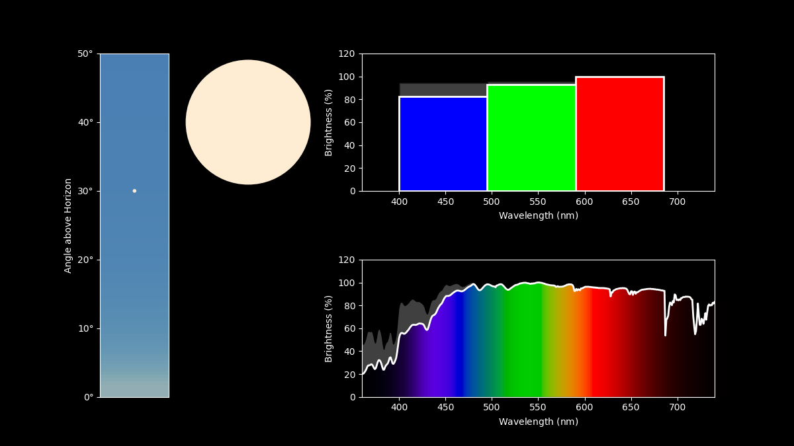

# rainbow-connection
A suite of pedagogical tools for talking about light and color in an astronomical context.

## Documentation
For detailed usage, please read the documentation [here](https://zkbt.github.io/rainbow-connection/).

## Example Usage
One of the goals of this package is to provide an easy interface to estimate the color of sunsets on various planets, both within and beyond the Solar System. Here's a simple example showing how to simulate a sunset on Earth:
```
import rainbowconnection as rc
import astropy.units as u

# create a light source representing the Sun at 1AU
s = rc.Sun().at(1*u.au)

# create an atmosphere for Earth
e = rc.Earth()

# transmit the light source through the atmosphere
t = e.transmit(s)

# plot the sun, with colors and spectra
t.plot_everything(zenith_angle=60*u.deg)
```



## Installation
You should be able to install this by running
```
pip install rainbow-connection
```
from a UNIX prompt.

If you want to be able to modify the code yourself, please also feel free to fork/clone this repository onto your own computer and install directly from that editable package. For example, this might look like:
```
git clone https://github.com/zkbt/rainbow-connection.git
cd rainbow-connection
pip install -e .
```
This will link the installed version of the `rainbowconnection` package to your local repository. Changes you make to the code in the repository should be reflected in the version Python sees when it tries to `import rainbowconnection`.

## Acknowledgements
These tools were originally developed to create visualizations for a TEDx Boulder talk by [Zach Berta-Thompson](https://tedxboulder.com/speakers/zachory-berta-thompson). Much of the inspiration for creating this toolkit comes out of an effort to reproduce Frederic Pont's [simulation of sunset on HD 209458b](http://www.exeter.ac.uk/news/featurednews/title_174814_en.html).

## Contributors

This package was written by [Zach Berta-Thompson](https://github.com/zkbt).
